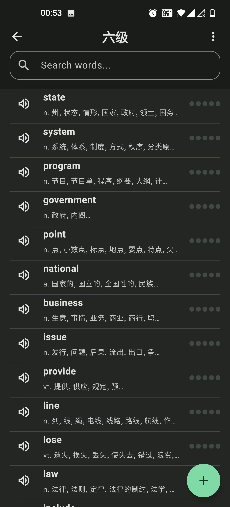

  

**LexiNote**

[中文](./README_zh.md)

# LexiNote - word memory and review application

LexiNote is a modern and simple app built with the latest Android development technologies. It aims to help language learners memorize and manage vocabulary efficiently through a scientific spaced repetition algorithm and rich interactive modes.

## ✨ Features

- **Notebook Management**: Create and manage multiple vocabulary notebooks.
- **Rich Word Entries**: Add words with definitions, phonetics, example sentences, images, and multiple audio pronunciations.
- **Spaced Repetition System (SRS)**: An intelligent review system based on the SM-2 algorithm to help you remember words for the long term.
- **Explore Module**: Import official vocabulary sets (e.g., CET-4, CET-6, TOEFL, IELTS) with a single click.
- **Private Vocabulary Search**: Quickly search through your own vocabulary.
- **Learning Statistics**: Track your learning progress and review statistics.
- **Import/Export**: Import and export the contents of the local word book.

## 💔 Incomplete Section

Because of copyright problems, I wasn't able to find suitable example sentences and images, so some features couldn't be finalized.

## 🛠️ Tech Stack & Architecture

- **Language**: [Kotlin](https://kotlinlang.org/)
- **UI**: [Jetpack Compose](https://developer.android.com/jetpack/compose) for a modern, declarative UI.
- **Architecture**: MVVM (Model-View-ViewModel) with principles of Clean Architecture.
- **Dependency Injection**: [Hilt](https://developer.android.com/training/dependency-injection/hilt-android) for managing dependencies.
- **Database**: [Room](https://developer.android.com/training/data-storage/room) for local persistence.
- **Networking**: [Ktor](https://ktor.io/) for making HTTP requests to the backend.
- **Asynchronous Programming**: [Kotlin Coroutines](https://kotlinlang.org/docs/coroutines-overview.html) and [Flow](https://kotlinlang.org/docs/flow.html) for managing background threads and data streams.

## 📸 Screenshots

| Home Screen | Word List | Flashcard View |
| :---: | :---: | :---: |
|  |  |  |

## 📖 Dictionary Source

The offline dictionary data used in this application is sourced from the [ECDICT](https://github.com/skywind3000/ECDICT) project. A big thank you to the contributors of that project for providing such a valuable resource.

## 📄 License

This project is licensed under the MIT License. See the [LICENSE](../LICENSE) file for details.
