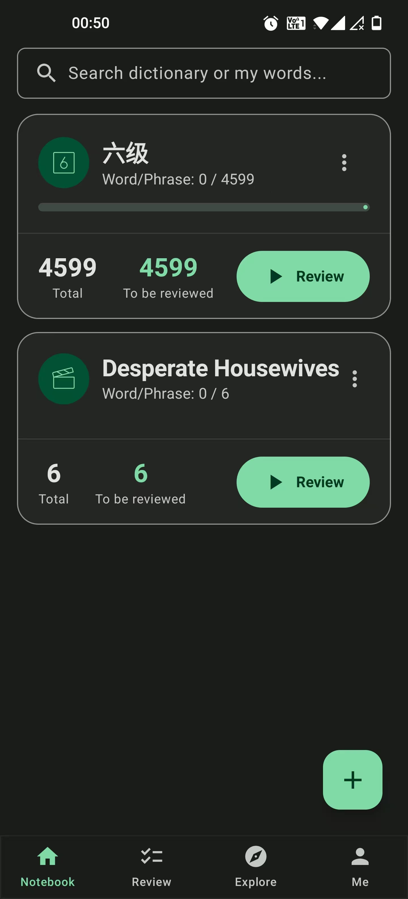
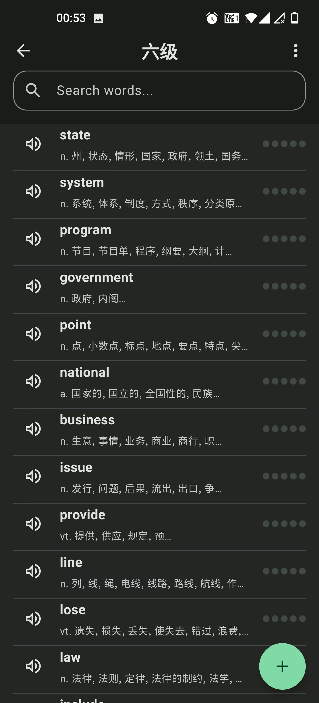

  

**乐词笔记**

[English](./README.md)

# 乐词笔记 - 单词记忆与复习应用

乐词笔记 是一款采用最新安卓开发技术构建的、功能现代且简单的App。旨在通过科学的间隔重复算法和丰富的交互模式，帮助语言学习者高效记忆和管理词汇。

## ✨ 主要功能

- **单词本管理**: 自由创建和管理多个单词本。
- **丰富的单词条目**: 添加单词时，可以包含词义、音标、例句、图片以及多种发音。
- **间隔重复系统 (SRS)**: 基于SM-2算法的智能复习系统，助你长久记忆单词。
- **发现模块**: 一键导入官方词库（例如：四级、六级、托福、雅思等）。
- **私有词库搜索**: 在自己的单词本中快速检索。
- **学习统计**: 跟踪你的学习进度和复习数据。
- **导入/导出**: 本地导入导出单词本内容。

## 💔 未完成部分

因为版权问题，没有找到合适的例句和图片，导致一些功能未能完善。

## 🛠️ 技术栈与架构

- **语言**: [Kotlin](https://kotlinlang.org/)
- **UI**: [Jetpack Compose](https://developer.android.com/jetpack/compose) - 用于构建现代化的声明式UI。
- **架构**: MVVM (Model-View-ViewModel)，并遵循 Clean Architecture 的设计原则。
- **依赖注入**: [Hilt](https://developer.android.com/training/dependency-injection/hilt-android) - 用于管理依赖关系。
- **数据库**: [Room](https://developer.android.com/training/data-storage/room) - 用于本地数据持久化。
- **网络**: [Ktor](https://ktor.io/) - 用于向后端发起HTTP请求。
- **异步编程**: [Kotlin Coroutines](https://kotlinlang.org/docs/coroutines-overview.html) & [Flow](https://kotlinlang.org/docs/flow.html) - 用于管理后台线程和数据流。

## 📸 应用截图

| 主屏幕 | 单词列表 | 闪卡复习 |
| :---: | :---: | :---: |
|  |  |  |

## 📖 词典数据来源

本应用使用的离线词典数据来源于 [ECDICT](https://github.com/skywind3000/ECDICT) 项目。非常感谢该项目的贡献者们提供了如此宝贵的资源。

## 📄 开源许可证

本项目采用 MIT 许可证。详情请见根目录下的 [LICENSE](../LICENSE) 文件。
